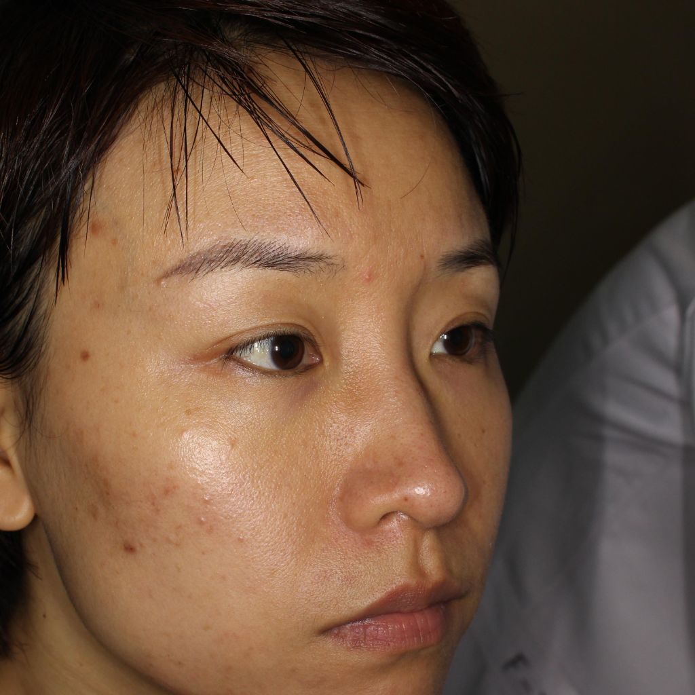
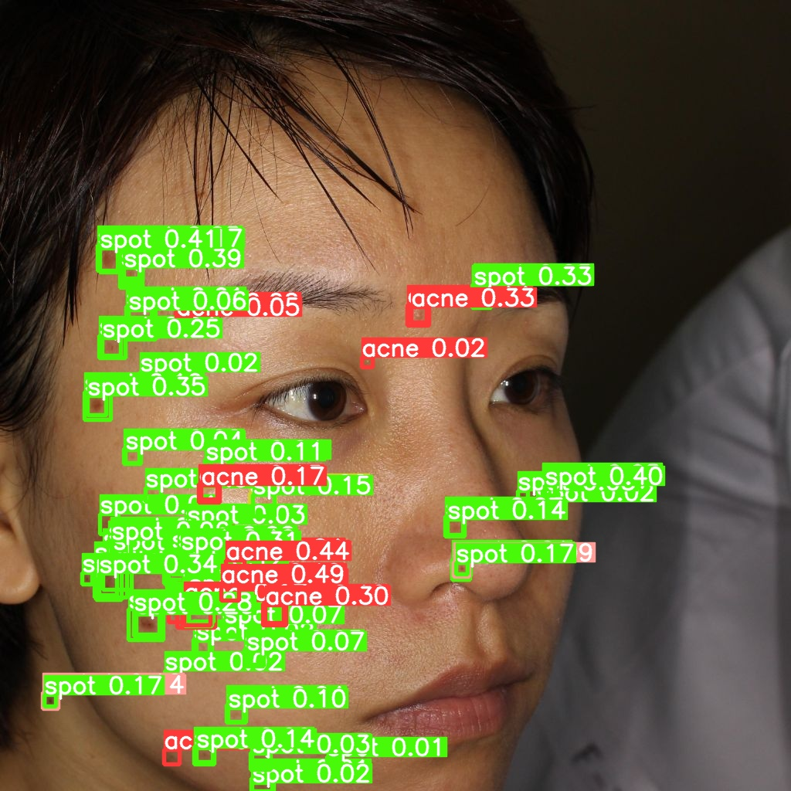
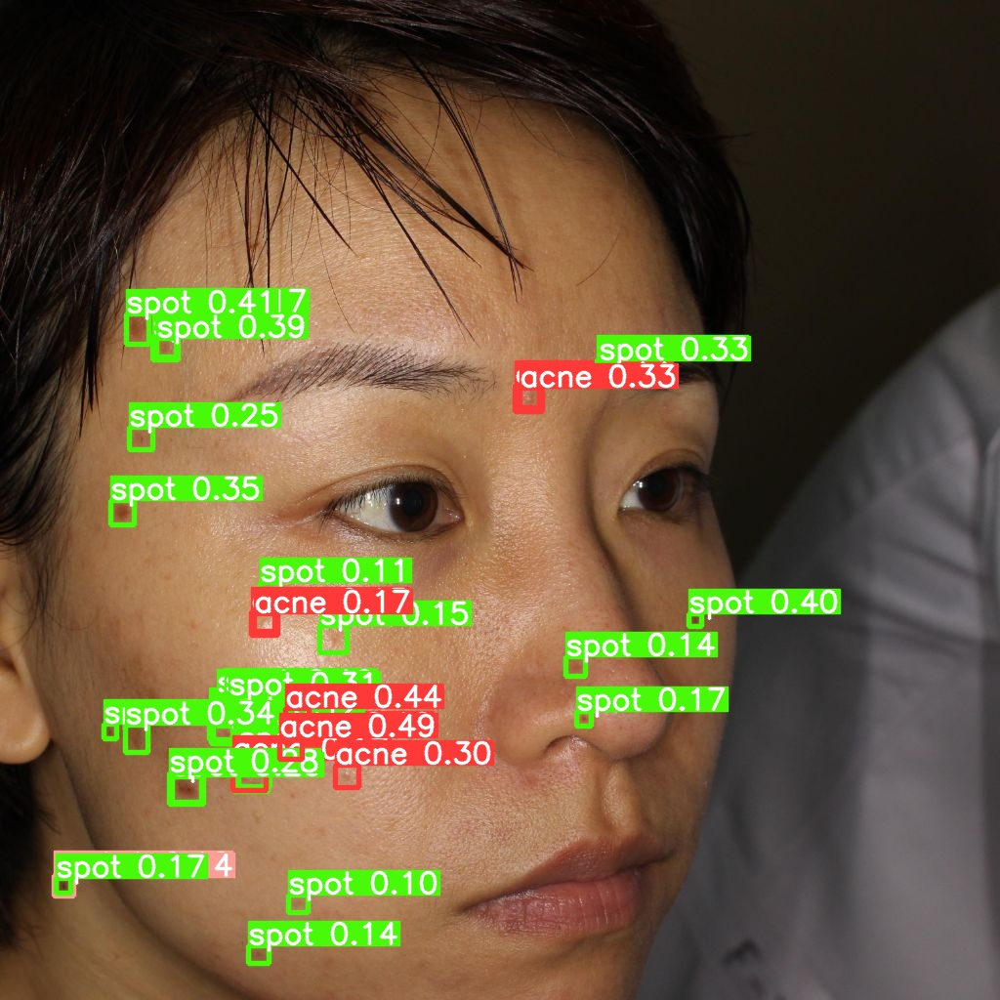
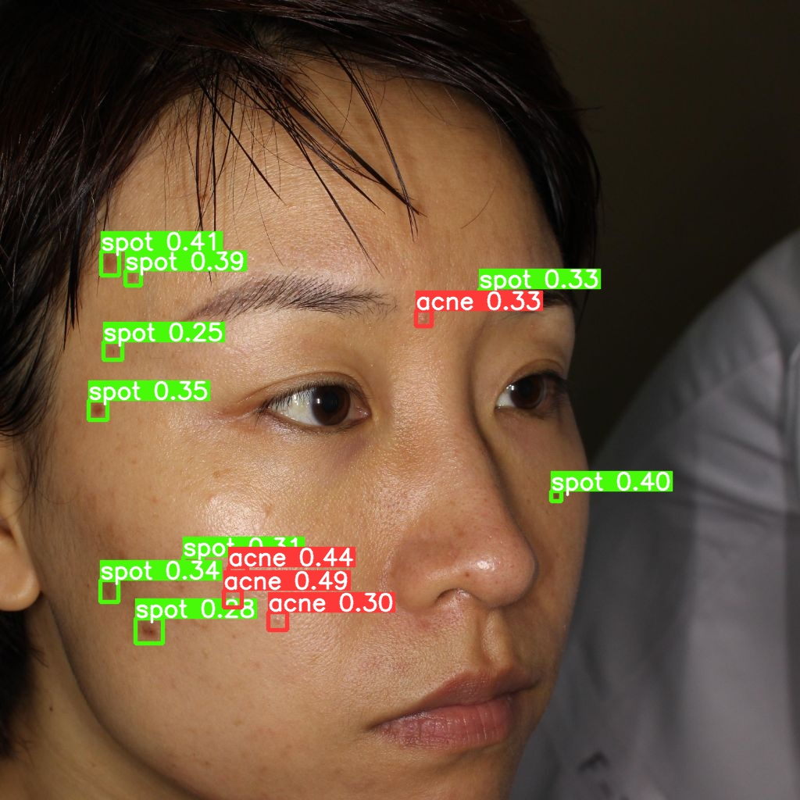

# YOLO v8 標記結果

## 資料來源
位於acne2noacne資料夾內
- **`trainA`, `testA`**: 有痘痘的照片（挑過），來自 [Kaggle Dataset](https://www.kaggle.com/datasets/manuelhettich/acne04)。

- **YOLO模型訓練資料**: 可於 Roboflow Universe [acne-new Image Dataset](https://universe.roboflow.com/buyumedatasets/acne-new/dataset/36) 上找到。

## 標記資料夾
- **`trainA_label`, `testA_label`**: YOLO模型的標記結果 (.txt格式)。

---

## 標記資料欄位說明

- **x**: 物件中心 x 位於整張圖片寬度的比例。
- **y**: 物件中心 y 位於整張圖片高度的比例。
- **w**: 物件的寬度，佔整張圖片寬度的比例。
- **h**: 物件的長度，佔整張圖片長度的比例。
- **conf**: YOLO 偵測到痘痘的機率，我把大於0的全部output了，可以自己設定threshold~

詳細說明可參考 [這篇文章](https://blog.cavedu.com/2019/07/25/yolo-identification-model/)。

---

## Conf 挑選

- **原始照片**

- **conf > 0.01**:
  

- **conf > 0.1**:
  

- **conf > 0.2**:
  
